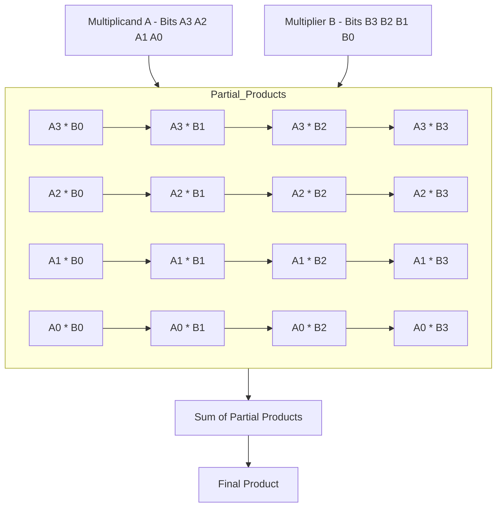

<!---

This file is used to generate your project datasheet. Please fill in the information below and delete any unused
sections.

You can also include images in this folder and reference them in the markdown. Each image must be less than
512 kb in size, and the combined size of all images must be less than 1 MB.
-->

<!---

This file is used to generate your project datasheet. Please fill in the information below and delete any unused
sections.

You can also include images in this folder and reference them in the markdown. Each image must be less than
512 kb in size, and the combined size of all images must be less than 1 MB.
-->

## How it works

An array multiplier performs binary multiplication by breaking down the multiplicand and multiplier into bits and computing partial products. These partial products are then summed row by row to form the final product.

Here's a visual representation of how an array multiplier works:

## How to test

To test the array multiplier:

1. Set up the multiplier by providing binary inputs for both the multiplicand (A) and the multiplier (B).
2. Run the simulation or test in hardware to verify that each partial product is calculated correctly.
3. Ensure that the partial products are properly shifted and summed to produce the final product.
4. Compare the final output with the expected result from standard binary multiplication to confirm accuracy.

## External hardware

No external hardware is required for this project. The array multiplier can be tested within a simulation environment or with an FPGA setup if hardware verification is needed.
